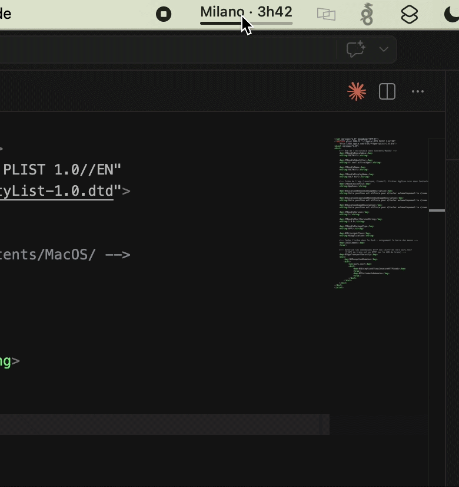

# SNCFWifi — Widget barre de menus macOS 🚄

[](https://github.com/antvgr/sncfwifi-macwidget/actions/workflows/build.yml)
[](https://github.com/antvgr/sncfwifi-macwidget/releases/latest)
[](https://github.com/nuclearrockstone/coding-with-ai-badge)

Un widget pour la barre de menus macOS qui exploite l'API du portail WiFi TGV Inoui pour afficher en temps réel les informations de votre trajet : gare suivante, vitesse, retard, données mobiles, etc.

<p align="center">
  
</p>

---

## Téléchargement ⬇️

> Pas besoin de compiler — téléchargez directement le `.zip` depuis la page **Releases**.

**[→ Télécharger la dernière version](https://github.com/antvgr/sncfwifi-macwidget/releases/latest)**

1. Décompressez le `.zip`
2. Glissez `SNCFWifi.app` dans votre dossier `Applications`
3. Double-cliquez pour lancer — l'icône apparaît dans la barre des menus

> **macOS bloque l'app** (non signée avec un certificat Apple Developer) lors du premier lancement. Deux options :
> - **Méthode simple** : faites un **clic droit → Ouvrir** sur `SNCFWifi.app`, puis cliquez **Ouvrir** dans la fenêtre d'avertissement
> - **Via le Terminal** : après avoir déplacé l'app dans `/Applications`, exécutez `xattr -cr /Applications/SNCFWifi.app` puis double-cliquez normalement

💡 **Lancement automatique au démarrage** : `Réglages Système > Général > Éléments de connexion` → cliquez `+` et ajoutez `SNCFWifi.app`.

---

## Fonctionnalités 🛠

- **Barre de menus** : affiche la prochaine gare, le temps restant, la vitesse et le retard éventuel en rotation
- **Menu déroulant** : numéro de train, liste des arrêts avec progression, consommation de données WiFi
- **Retard** : affichage tournant `⚠ +5min · Régulation du trafic` quand le train est en retard
- **Mode Démo** : serveur local pour tester sans être dans un TGV

---

## Prérequis ⚙️

- macOS 11 (Big Sur) ou plus récent — Apple Silicon et Intel (binaire universel)
- Connexion au réseau WiFi d'un TGV Inoui pour que l'API réponde
- *(pour compiler)* Xcode Command Line Tools (`xcode-select --install`)

---

## Compilation manuelle 🔨

Un script bash compile et empaquète le projet en `.app` :

```bash
chmod +x build.sh
./build.sh
open SNCFWifi.app
```

💡 **Démarrage automatique** : `Réglages Système > Général > Éléments de connexion > ajouter SNCFWifi.app`

---

## Mode Démo via serveur local 🧪

Permet de simuler un trajet TGV sans connexion au WiFi du train.

1. Lancer le serveur :
   ```bash
   chmod +x start_demo_server.sh
   ./start_demo_server.sh
   ```
2. Ouvrir le panneau de configuration :
   - dans l'app : **Ouvrir le panneau Démo**
   - ou directement : `http://127.0.0.1:8787`
3. Activer **Mode Démo** dans l'app.

Endpoints simulés :
| Endpoint | Description |
|---|---|
| `GET /router/api/train/gps` | Position GPS |
| `GET /router/api/train/progress` | Progression du trajet |
| `GET /router/api/train/details` | Détails (arrêts, retard, numéro) |
| `GET /router/api/bar/attendance` | Affluence au bar |
| `GET /router/api/connection/statistics` | Consommation données |

---

## Développé avec l'IA 🤖

Ce projet a été développé en grande partie avec l'aide de l'Intelligence Artificielle.


